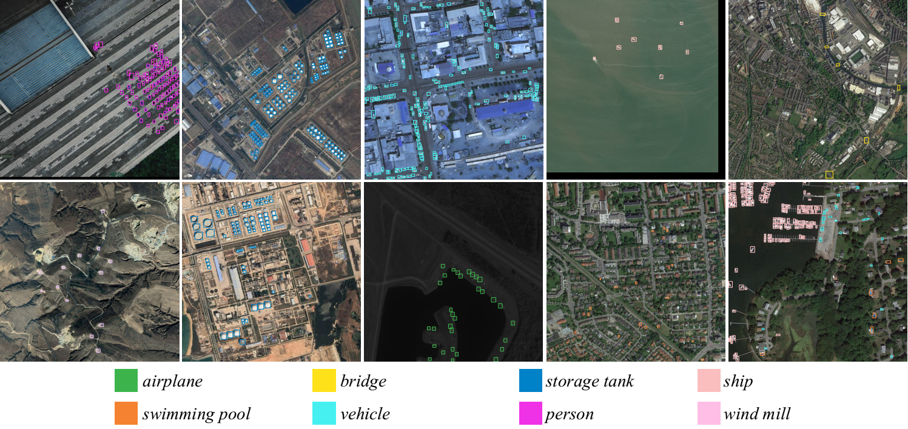
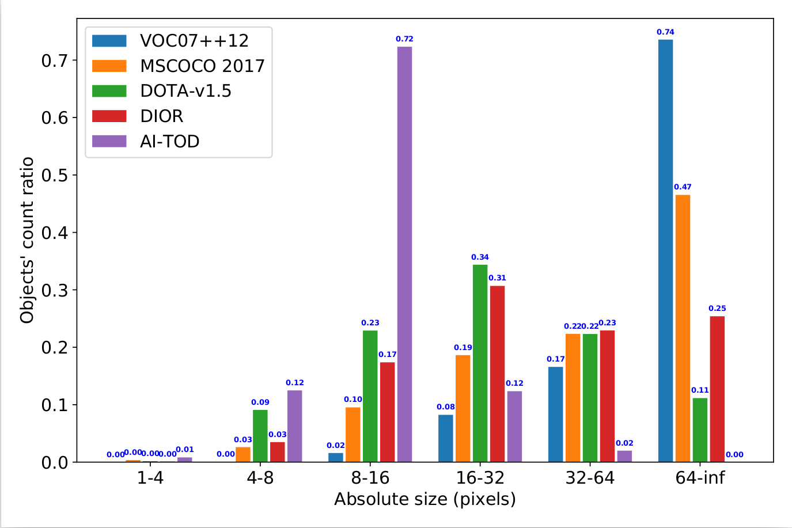

# AI-TOD

AI-TOD is a dataset for tiny object detection in aerial images.

[[Paper]](https://drive.google.com/file/d/1IiTp7gilwDCGr8QR_H9Covz8aVK7LXiI/view?usp=sharing)

Please download the [xView trainig set](http://xviewdataset.org/#dataset) and [AI-TOD_wo_xview](https://pan.baidu.com/s/1AlhHIxpvkJ1-2ql9JdWqKg) to synthesize the complete AI-TOD dataset!



## Description

AI-TOD comes with 700,621 object instances for eight categories across 28,036 aerial images. Compared to existing object detection datasets in aerial images, the mean size of objects in AI-TOD is about 12.8 pixels, which is much smaller than others.



## Download 

You need to download the following two parts (xView training set, AI-TOD without xview) and use our end-to-end synthesis tool to generate the complete AI-TOD dataset.
* xView training set. [website](http://xviewdataset.org/#dataset)
* AI-TOD_wo_xview. [BaiduDrive:w2dy](https://pan.baidu.com/s/1AlhHIxpvkJ1-2ql9JdWqKg) [Google Drive]
* E2E aitodtoolkit. [Folder](aitodtoolkit)

<!-- You can download the dataset on [Google Drive](https://drive.google.com/drive/folders/1mokzFtLCjyqalSEajYTUmyzXvOHAa4WX?usp=sharing) or [Baidu Drive](https://pan.baidu.com/s/1r2C_fBwQL4q2NRmDM3-RUw) (Password: 0ire). -->

## A Guide of Synthesizing AI-TOD
Step 1: Downloadthe xView training set, AI-TOD without xview, and clone the aitodtoolkit.

Step 2: Organize the downloaded files in the following way.

```
├─aitod
│  ├─annotations
│  └─images
│      ├─test
│      ├─train
│      ├─trainval
│      └─val
├─aitod_xview
└─xview
    └─ori
        └─train_images
```


Step 3: Install required packages.

Step 4: Run the E2E aitodtoolkit and get AI-TOD.

## Evaluation
Training, Validation and Testing sets are both publicly available now. We report the COCO style performance in the original paper, you can use the [cocoapi-aitod](https://github.com/jwwangchn/cocoapi-aitod) to evaluate the model performance.


## Citation

If you use this dataset in your research, please consider citing these papers.

```
@inproceedings{AI-TOD_2020_ICPR,
    title={Tiny Object Detection in Aerial Images},
    author={Wang, Jinwang and Yang, Wen and Guo, Haowen and Zhang, Ruixiang and Xia, Gui-Song},
    booktitle=ICPR,
    pages={3791--3798},
    year={2021},
}
```

```
@article{NWD_2021_arXiv,
  title={A Normalized Gaussian Wasserstein Distance for Tiny Object Detection},
  author={Wang, Jinwang and Xu, Chang and Yang, Wen and Yu, Lei},
  journal={arXiv preprint arXiv:2110.13389},
  year={2021}
}
```
## Reference
[xView Dataset](http://xviewdataset.org/)

## License

The AI-TOD dataset is licensed under the Attribution-NonCommercial-ShareAlike 4.0 International ([CC BY-NC-SA 4.0](https://creativecommons.org/licenses/by-nc-sa/4.0/)). Thus AI-TOD dataset are freely available for academic purpose or individual reserach, but restricted for commercial use. Besides, the underlying codes are licensed under the MIT license.
